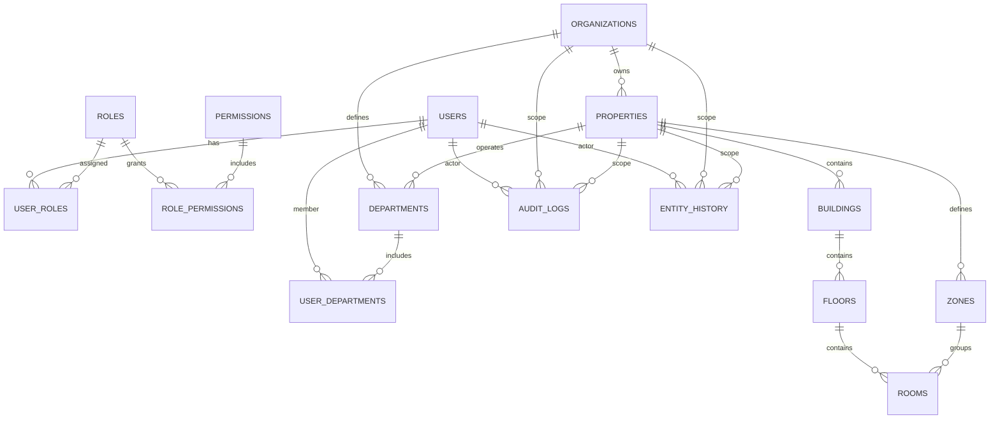

# Database Schema Design (Conceptual)

This document describes the conceptual schema only. It does not include DDL, migrations, or implementation details.

## Scope
- Core tables: users, roles, permissions, departments
- Hotel/property structure
- Audit and tracking

## Entity-Relationship Diagram (ERD)

## Core Tables

USERS
- id (PK)
- org_id (FK -> ORGANIZATIONS.id)
- email (unique within org)
- phone
- display_name
- status (active, suspended, invited)
- last_login_at
- created_at
- updated_at

ROLES
- id (PK)
- org_id (FK -> ORGANIZATIONS.id)
- name (unique within org)
- description
- created_at
- updated_at

PERMISSIONS
- id (PK)
- code (global unique, e.g., "workorders.create")
- description

ROLE_PERMISSIONS
- id (PK)
- role_id (FK -> ROLES.id)
- permission_id (FK -> PERMISSIONS.id)
- created_at

USER_ROLES
- id (PK)
- user_id (FK -> USERS.id)
- role_id (FK -> ROLES.id)
- assigned_at
- assigned_by (FK -> USERS.id, nullable)

DEPARTMENTS
- id (PK)
- org_id (FK -> ORGANIZATIONS.id)
- property_id (FK -> PROPERTIES.id, nullable)
- name
- description
- created_at
- updated_at

USER_DEPARTMENTS
- id (PK)
- user_id (FK -> USERS.id)
- department_id (FK -> DEPARTMENTS.id)
- is_primary
- assigned_at

## Hotel / Property Structure

ORGANIZATIONS
- id (PK)
- name
- legal_name
- status
- created_at
- updated_at

PROPERTIES
- id (PK)
- org_id (FK -> ORGANIZATIONS.id)
- code (unique within org)
- name
- timezone
- address_line1
- address_line2
- city
- state
- postal_code
- country
- created_at
- updated_at

BUILDINGS
- id (PK)
- property_id (FK -> PROPERTIES.id)
- name
- code
- created_at
- updated_at

FLOORS
- id (PK)
- building_id (FK -> BUILDINGS.id)
- level_number
- name
- created_at
- updated_at

ROOMS
- id (PK)
- floor_id (FK -> FLOORS.id)
- property_id (FK -> PROPERTIES.id)
- room_number
- room_type
- status
- created_at
- updated_at

ZONES
- id (PK)
- property_id (FK -> PROPERTIES.id)
- name
- code
- created_at
- updated_at

## Audit and Tracking

AUDIT_LOGS
- id (PK)
- org_id (FK -> ORGANIZATIONS.id)
- property_id (FK -> PROPERTIES.id, nullable)
- actor_user_id (FK -> USERS.id, nullable)
- action (e.g., "user.create")
- target_type (table or domain entity name)
- target_id (nullable)
- metadata_json (serialized context)
- ip_address
- user_agent
- created_at

ENTITY_HISTORY
- id (PK)
- org_id (FK -> ORGANIZATIONS.id)
- property_id (FK -> PROPERTIES.id, nullable)
- actor_user_id (FK -> USERS.id, nullable)
- entity_type
- entity_id
- change_type (create, update, delete)
- before_json
- after_json
- created_at

## Relationship Notes
- Users belong to an organization and can have multiple roles and departments.
- Roles are organization-scoped; permissions are global definitions.
- Departments can be organization-wide or property-specific.
- Properties belong to organizations and contain buildings, floors, rooms, and zones.
- Audit and history are scoped by organization and optionally property.

## Indexing Guidance (Conceptual)
- USERS: unique index on (org_id, email)
- ROLES: unique index on (org_id, name)
- PROPERTIES: unique index on (org_id, code)
- ROOMS: unique index on (property_id, room_number)
- AUDIT_LOGS: index on (org_id, created_at), (property_id, created_at)
